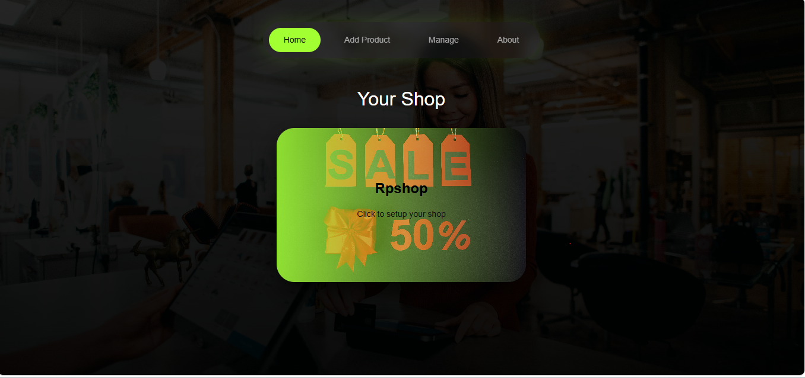
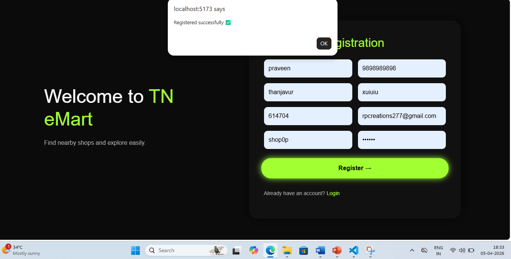
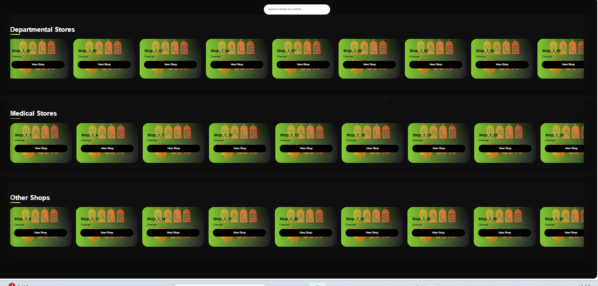

# React + Vite

This template provides a minimal setup to get React working in Vite with HMR and some ESLint rules.

Currently, two official plugins are available:

- [@vitejs/plugin-react](https://github.com/vitejs/vite-plugin-react/blob/main/packages/plugin-react) uses [Babel](https://babeljs.io/) (or [oxc](https://oxc.rs) when used in [rolldown-vite](https://vite.dev/guide/rolldown)) for Fast Refresh
- [@vitejs/plugin-react-swc](https://github.com/vitejs/vite-plugin-react/blob/main/packages/plugin-react-swc) uses [SWC](https://swc.rs/) for Fast Refresh

## React Compiler

The React Compiler is not enabled on this template because of its impact on dev & build performances. To add it, see [this documentation](https://react.dev/learn/react-compiler/installation).

## Expanding the ESLint configuration

If you are developing a production application, we recommend using TypeScript with type-aware lint rules enabled. Check out the [TS template](https://github.com/vitejs/vite/tree/main/packages/create-vite/template-react-ts) for information on how to integrate TypeScript and [`typescript-eslint`](https://typescript-eslint.io) in your project.
Developed a full-stack web application that bridges the gap between local shopkeepers and customers by providing a digital platform for business discovery, product management, and price comparison. The primary objective of the system is to help small and medium-sized local businesses establish an online presence while enabling customers to explore products and compare prices without physically visiting multiple stores.

The application was built using React.js for the frontend, Node.js and Express.js for the backend, and MySQL as the relational database. The system follows a client-server architecture and utilizes RESTful APIs for seamless communication between the user interface and the database.

The platform supports two distinct user roles: Shopkeepers and Customers. Shopkeepers can register their businesses, create digital storefronts, categorize their shops, and manage product listings. Customers can browse shops, search businesses based on district, explore products, and compare offerings from multiple vendors. The system also includes dynamic filtering, category-based navigation, authentication mechanisms, and real-time data retrieval from the database.

To simulate a realistic business environment, a large dataset of shop records was integrated into the database, enabling efficient search and filtering operations. The project demonstrates practical implementation of frontend development, backend API design, database management, user authentication, and data-driven application architecture.

This project strengthened my understanding of full-stack development, REST API integration, database relationships, state management, and scalable web application design. It also reflects my ability to identify real-world problems, design user-centric solutions, and develop complete end-to-end software systems using modern web technologies.

Technologies Used: React.js, Node.js, Express.js, MySQL, JavaScript, HTML5, CSS3, REST APIs.
# DoEmart

## Home Page

## Login Page

## Dashboard

.png)

## All Shop

